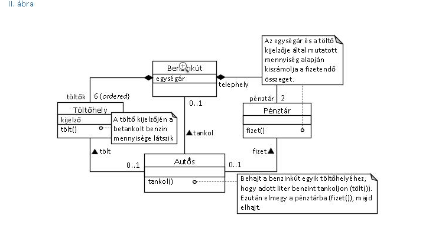

# Házi feladat

 A táblás gyakorlaton elhangzott benzinkutas feladat megvalósítása.

 

## Értékelési szempontok:
- A dokumentáció és a program felépítése azonos.
- Az ábrán jelzett függvények úgy működnek ahogy ott leírásra kerültek
- Nincs programhiba.
- A Heap-en lefoglalt változók törlésre kerülnek.
- Végig csinálható a megvalósított osztályokkal egy tankolási folyamat.
- A benzinkút és a hozzá tartozó osztályok hiba esetén throw paranccsal dobják a hibaüzenteket, nem írnak a console kimenetre (ez csak az ábrán látható osztályokra vonatkozik, az őket felhasználó program kommunikálhat a felhasználóval a megszokott módon).
- A kúttal együtt a töltőhelyek (6db) és pénztárak (2db) szoros egységet képeznek, egyszerre jönnek létre és szűnnek meg.
- Míg egy töltőállomáson nem rendezték a számlát, ne lehessen oda új autóst fogadni.
- Üres töltőállomásokra lehessen autóst fogadni akkor is ha egy másik állomás épp használatban van.

### Példa folyamat
- Benzinkút létrehozása
- Autós létrehozása
- Autós `tankol`-ni szeretne a kúton, kiválasztásra kerül egy üres töltőhely neki.
- A töltőhelyen `tölt` valamennyi üzemanyagot, megnézi a kijelzőn látható értéket. 
- Az autós az egyik pénztárban fizet, a töltőhelyen lévő kijelző 0-ra áll, újra fogadhat autóst.
- Gondoskodás az osztályok megfelelő megszűnéséről.

